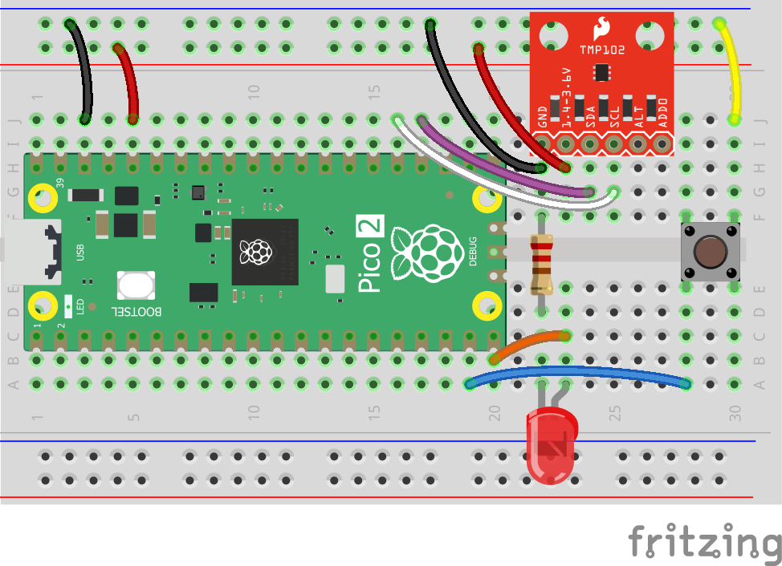
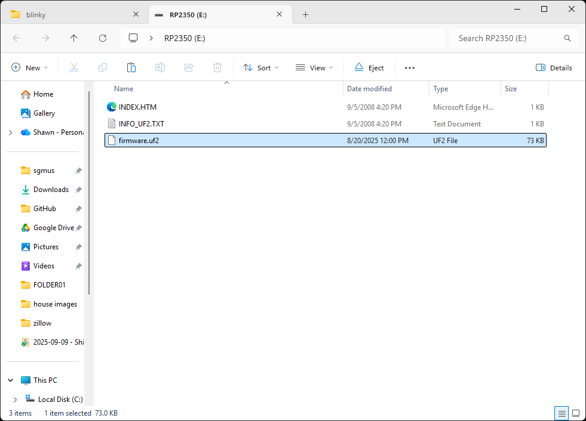
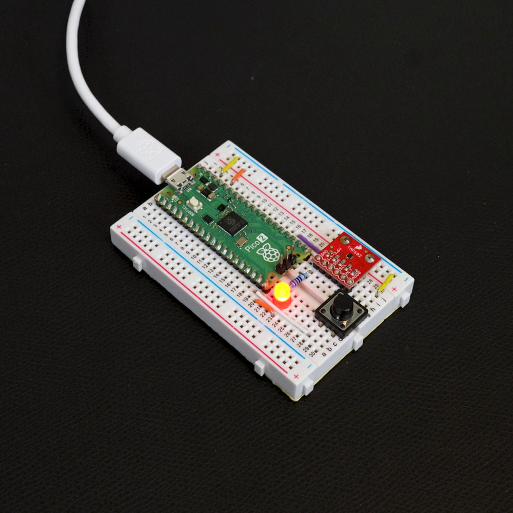
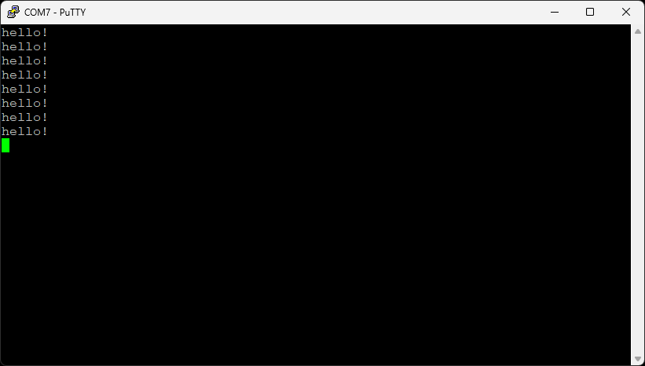

# Intro to Embedded Rust Workshop

Welcome to the Intro to Embedded Rust Workshop! This worksheet will guide you through the hands-on portion of creating a few simple demos in Rust for a Raspberry Pi Pico 2. Simply follow the directions to get started.

* **Workshop level**: intermediate
* **Expected completion time**: 2 hours

**NOTE**: supporting slides for the workshop can be found in the *slides/* directory.

## Prerequisites

I highly recommend being familiar with C (i.e. understanding heap vs. stack and how pointers work) and some embedded concepts (e.g. GPIO, I2C) before tackling this tutorial.

## Required Hardware

For this workshop, you will need the following components:

* [Raspberry Pi Pico 2](https://www.digikey.com/en/products/detail/raspberry-pi/SC1631/24627142) (any of the variants, H, W, WH, will also work, just note that we will not be using WiFi)
* [TMP102 Temperature Sensor Breakout Board](https://www.digikey.com/en/products/detail/sparkfun-electronics/13314/6797646) (you will need to solder [header pins](https://www.digikey.com/en/products/detail/sullins-connector-solutions/PRPC040SAAN-RC/2775214) to this board)
* [LED](https://www.digikey.com/en/products/detail/lite-on-inc/LTL-4224/217584)
* [220 Ω resistor](https://www.digikey.com/en/products/detail/stackpole-electronics-inc/CF14JT220R/1830334)
* [Pushbutton](https://www.digikey.com/en/products/detail/te-connectivity-alcoswitch-switches/1825910-6/1632536)
* [Solderless breadboard](https://www.digikey.com/en/products/detail/dfrobot/FIT0096/7597069)
* [Jumper wires](https://www.digikey.com/en/products/detail/adafruit-industries-llc/1957/6827090)
* [USB A to micro B cable](https://www.digikey.ee/en/products/detail/cvilux-usa/DH-20M50055/13175849)

Connect the components together as follows:



## Install Rust and picotool

For this workshop, you will need [Rust](https://rust-lang.org/) (edition 2024) along with [picotool]() for converting the binary into a UF2 file that can be copied to the USB mass storage device bootloader on the Pico 2. There are two ways to install these requirements:

1. Install Docker Desktop and build the pre-made Docker image
2. Install Rust and picotool manually on your computer

I recommend #1, as it includes all of the necessary components to complete the workshop (and you can just delete the Docker image when you're done). But if you don't like Docker, you're welcome to install everything manually.

### Option 1: Install Docker Desktop and Build Image

If you want to use Docker, follow the directions on [this page](https://www.docker.com/products/docker-desktop/) to install *Docker Desktop*.

Make sure Docker Desktop is running. Open a command prompt (bash, zsh, PowerShell), navigate to this directory, and build the Docker image:

```sh
docker build -t env-embedded-rust-workshop  .
```

To run:

Linux, macOS, Windows (PowerShell):

```sh
docker run --rm -it -v "$(pwd)/workspace:/home/student/workspace" -w /workspace env-embedded-rust-workshop
```

This will open an interactive terminal that you can use to compile your code and generate UF2 files. If you see a prompt like `student@<SOME_HEX_VALUES>:~$ ` then you know it worked.

**IMPORTANT**: Files in the `workspace/` folder will be saved to your host computer. Everything else will be deleted when you exit out of the Docker container.

For the best experience, I recommend using [VS Code](https://code.visualstudio.com/) and installing the [Dev Contaienrs](https://marketplace.visualstudio.com/items?itemName=ms-vscode-remote.remote-containers) extension. Then in VS Code, press *ctrl + shift + p* and enter `Dev Containers: Attach to Running Container`. Press *enter* to select the *attach to running container* option and press *enter* again to connect to your `env-embedded-rust-workshop` container. That should open a new window.

You should now be in a new VS Code instance connected to the running container. In that window, select **File > Open Workspace from File...** and select `/home/student/workspace/default.code-workspace`. If you get a pop-up asking you to install the recommended extensions, click **Install**.

Once that completes, you might get another pop-up saying that the *Cortex-Debug* extension could not be activated. Simply click **Reload Window** to fix the problem. You should now be ready to develop in a full-featured VS Code instance with IntelliSense configured for embedded Rust.

### Option 2: Install Rust Locally

If you want to install Rust locally on your computer, simply follow the [directions on the Rust site](https://rust-lang.org/learn/get-started/).

You will also need *picotool* to convert ELF binaries into UF2 files, and installing it can be a little tricky. You have a few ways to install picotool:

1. Try installing it directly from the binary built for your OS [downloaded from here](https://github.com/raspberrypi/pico-sdk-tools/reeases/tag/v2.2.0-3) (look for `picotool-2.2.0-a4-<YOUR_OS>`)
2. If that does not work and you are on macOS, you can try the [picotool homebrew formula](https://formulae.brew.sh/formula/picotool)
3. If that does not work, you can try to [build it from source](https://github.com/raspberrypi/picotool/blob/master/BUILDING.md#building)

For #1, I recommend performing the following steps (depending on your OS):

**Windows**

* Download `picotool-2.2.0-a4-x64-win.zip` and unzip it
* Copy the files in the `picotool/` directory to `C:\Program Files\picotool\`
* Open a new *PowerShell* terminal
* Run the following command to temporarily add picotool to your PATH (you will need to do this every time you open a new terminal and want to use picotool):

```
$env:Path += ";C:\Program Files\picotool"
```

**Linux**

Assuming you're using a Debian flavor:

* Download `picotool-2.2.0-a4-x86_64-lin.tar.gz` or `picotool-2.2.0-a4-aarch64-lin.tar.gz` and unzip it
* Copy the files in `picotool/` binary files to `~/.local/bin/picotool/`

Most distros should include `~/.local/bin/` in PATH be default, but if you cannot run `picotool`, then you need to add it to your PATH. This will add `~/.local/bin/` to your PATH temporarily (you will need to do this every time you open a new terminal and want to use picotool):

```sh
export PATH="$HOME/.local/bin:$PATH"
```

**macOS**

* Download `picotool-2.2.0-a4-mac.zip` and unzip it
* Copy the files in `picotool/` binary files to `~/.local/bin/picotool/`
* Open a new terminal (e.g. zsh)
* Run the following command to temporarily add picotool to your PATH (you will need to do this every time you open a new terminal and want to use picotool):

```sh
export PATH="$HOME/.local/bin:$PATH"
```

## Install Serial Terminal

To view the output of our embedded applications, you will need a serial terminal. If you have a favorite, you are welcome to use that. Otherwise, I recommend downloading and installing one of the following, depending on your OS:

* Windows: [PuTTY](https://www.chiark.greenend.org.uk/~sgtatham/putty/)
* Linux: [minicom](https://www.cyberciti.biz/tips/connect-soekris-single-board-computer-using-minicom.html)
* macOS: [minicom](https://formulae.brew.sh/formula/minicom)

## Exercise 1: Blinky Demo

**NOTE**: I will assume you are using the Docker image for the rest of the guide. If you installed Rust and picotool locally, the commands should be very similar, but you will execute them in a terminal on your host computer (rather than in the Docker container's terminal).

**ALSO NOTE**: Use whatever file editor you are comfortable with. For the rest of this guide, I will assume that you are using VS Code attached to the running Docker container via the Dev Containers extension.

Feel free to look through the code in *workspace/apps/blinky/*. We will treat this as a boilerplate template going forward, as there is a lot of complex setup happening to make code run on our target microcontroller. Here is a breakdown of the files:

* `.cargo/config.toml` - Configures the Rust compiler to target the Cortex-M33 processor with FPU support and sets up linker flags for embedded ARM development.
* `Cargo.toml` - Defines the project dependencies, including the RP2350 hardware abstraction layer (HAL) and embedded development libraries for the Raspberry Pi Pico 2.
* `memory.x` - Linker script that maps the RP2350's memory regions (Flash, RAM, and SRAM banks) and defines special sections for boot ROM metadata and binary info that the bootloader needs.
* `src/main.rs` - The main application that initializes the RP2350 hardware (clocks, GPIO, timer) and blinks an LED on pin GPIO15 by toggling it on/off every 500ms in an infinite loop.

In your container terminal (the one with `student@<SOME_HEX_VALUES>:~$`), enter the following to build the project:

```sh
cd ~/workspace/apps/blinky
cargo build
```

**NOTE**: if you installed Rust and picotool locally, you should be able to enter the commands into any terminal on your computer.

Cargo is Rust's official build system and package manager that handles compiling code, managing dependencies, running tests, and building projects. It uses Cargo.toml files to define project metadata and dependencies, automatically downloading and linking the libraries your project needs.

The build process should complete without any errors. This produces the binary file `blinky/target/thumbv8m.main-none-eabihf/debug/blinky`. Note that this binary is in .ELF format and has the same name as the project `name` given in `Cargo.toml`.

Feel free to check the flash size (.text) of the binary with:

```sh
cargo size
```

It should say that the binary will take up around 110 kB in flash memory. That's a LOT for simple blink! That's because we used the *debug* profile, which contains a lot of extra debugging information. Try building for the *release* profile and checking the size (all with one command):

```sh
cargo size --release
```

15 kB is much more reasonable, especially considering this includes a full USB client stack.

Next, you will need to convert the .ELF file into a .UF2 file. Enter the following in the container terminal:

```sh
picotool uf2 convert target/thumbv8m.main-none-eabihf/debug/blinky -t elf firmware.uf2
```

This should generate a file named `firmware.uf2` in your *blinky/* folder.

Hold the **BOOTSEL** button on your Pico 2 board and plug it into your computer via USB cable. This should cause the host OS to enumerate it as a mass storage device (i.e. a new drive) on your computer. Copy `blinky/firmware.uf2` to the root of the enumerated drive.



Your Pico 2 should automatically restart, and the LED should start flashing.



Now, you should test the serial connection:

**Windows**

Open the Device Manager and find the COM port for your connected Pico 2 (e.g. COM7 for me).

Open PuTTY. Select **Serial** and fill out the COM port number (e.g. COM7) and set *Speed* to **115200**. Click **Open**. You should see "hello!" appear once per second.



**Linux and macOS**

You first need to find the serial device associated with your Pico 2:

```sh
ls /dev/tty*
```

You should see something like `ttyACM0` or `ttyUSB0` on Linux or `tty.usbmodem<SOME_STUFF>` on macOS.

On Linux, you might need to add yourself to the `dialout` group: `sudo usermod -a -G dialout $USER`

Then, connect to the Pico 2 (change `<SERIAL_DEV_PATH>` to your particular serial device, e.g. `/dev/ttyACM0`):

```sh
minicom -D <SERIAL_DEV_PATH> -b 115200
```

You should see `hello!` being printed to the console.

Press *ctrl+a* then *x* to exit.

## Exercise 2: Ownership and Borrowing

