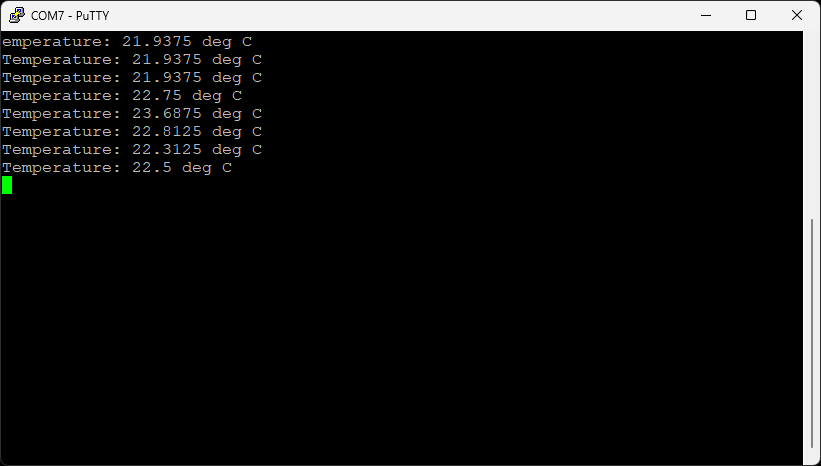

# Intro to Embedded Rust Workshop

Welcome to the Intro to Embedded Rust Workshop! This worksheet will guide you through the hands-on portion of creating a few simple demos in Rust for a Raspberry Pi Pico 2. Simply follow the directions to get started.

* **Workshop level**: intermediate
* **Expected completion time**: 2 hours

**NOTE**: supporting slides for the workshop can be found in the *slides/* directory.

**ALSO NOTE**: The directories with the prefix `solution-` contain my solutions to the exercises and challenges. I recommend trying your hand at them first before peeking at the answer. If you're running out of time, you're welcome to continue working on them after the workshop or feel free to look at the solution.

## Table of Contents

- [Prerequisites](#prerequisites)
- [Required Hardware](#required-hardware)
- [Install Rust and picotool](#install-rust-and-picotool)
  - [Option 1: Install Docker Desktop and Build Image](#option-1-install-docker-desktop-and-build-image)
  - [Option 2: Install Rust Locally](#option-2-install-rust-locally)
- [Exercise 1: Blinky](#exercise-1-blinky)
- [Exercise 2: Ownership and Borrowing](#exercise-2-ownership-and-borrowing)
- [Exercise 3: I2C Temperature Sensor](#exercise-3-i2c-temperature-sensor)
  - [Cargo.toml](#cargotoml)
  - [Build and Flash](#build-and-flash)
- [Challenge 1: Add a Button](#challenge-1-add-a-button)
- [Challenge 2: Debounce](#challenge-2-debounce)
- [Challenge 3: Generics and Traits](#challenge-3-generics-and-traits)
- [License](#license)

## Prerequisites

I highly recommend being familiar with C (i.e. understanding heap vs. stack and how pointers work) and some embedded concepts (e.g. GPIO, I2C) before tackling this tutorial.

## Required Hardware

For this workshop, you will need the following components:

* [Raspberry Pi Pico 2](https://www.digikey.com/en/products/detail/raspberry-pi/SC1631/24627142) (any of the variants, H, W, WH, will also work, just note that we will not be using WiFi)
* [TMP102 Temperature Sensor Breakout Board](https://www.digikey.com/en/products/detail/sparkfun-electronics/13314/6797646) (you will need to solder [header pins](https://www.digikey.com/en/products/detail/sullins-connector-solutions/PRPC040SAAN-RC/2775214) to this board)
* [LED](https://www.digikey.com/en/products/detail/lite-on-inc/LTL-4224/217584)
* [220 Ω resistor](https://www.digikey.com/en/products/detail/stackpole-electronics-inc/CF14JT220R/1830334)
* [Pushbutton](https://www.digikey.com/en/products/detail/te-connectivity-alcoswitch-switches/1825910-6/1632536)
* [Solderless breadboard](https://www.digikey.com/en/products/detail/dfrobot/FIT0096/7597069)
* [Jumper wires](https://www.digikey.com/en/products/detail/adafruit-industries-llc/1957/6827090)
* [USB A to micro B cable](https://www.digikey.ee/en/products/detail/cvilux-usa/DH-20M50055/13175849)

Connect the components together as follows:


## Install Rust and picotool

For this workshop, you will need [Rust](https://rust-lang.org/) (edition 2024) along with [picotool]() for converting the binary into a UF2 file that can be copied to the USB mass storage device bootloader on the Pico 2. There are two ways to install these requirements:

1. Install Docker Desktop and build the pre-made Docker image
2. Install Rust and picotool manually on your computer

I recommend #1, as it includes all of the necessary components to complete the workshop (and you can just delete the Docker image when you're done). But if you don't like Docker, you're welcome to install everything manually.

### Option 1: Install Docker Desktop and Build Image

If you want to use Docker, follow the directions on [this page](https://www.docker.com/products/docker-desktop/) to install *Docker Desktop*.

Make sure Docker Desktop is running. Open a command prompt (bash, zsh, PowerShell), navigate to this directory, and build the Docker image:

```sh
docker build -t env-embedded-rust-workshop  .
```

**IMPORTANT**: Files in the `workspace/` folder will be saved to your host computer. Everything else will be deleted when you exit out of the Docker container.

For the best experience, I recommend using [VS Code](https://code.visualstudio.com/) and installing the [Dev Contaienrs](https://marketplace.visualstudio.com/items?itemName=ms-vscode-remote.remote-containers) extension. Then in VS Code, press *ctrl + shift + p* and enter `Dev Containers: Attach to Running Container`. Press *enter* to select the *attach to running container* option and press *enter* again to connect to your `env-embedded-rust-workshop` container. That should open a new window.

You should now be in a new VS Code instance connected to the running container. In that window, select **File > Open Workspace from File...** and select `/home/student/workspace/default.code-workspace`. If you get a pop-up asking you to install the recommended extensions, click **Install**.

Once that completes, you might get another pop-up saying that the *Cortex-Debug* extension could not be activated. Simply click **Reload Window** to fix the problem. You should now be ready to develop in a full-featured VS Code instance with IntelliSense configured for embedded Rust. If *rust-analyzer* is throwing an error (red bar in the bottom left of VS Code), you can press *ctrl + shift + p*, type `restart server` and select **rust-analyzer: Restart server**. That usually fixes the issue. 

**Optional**: you can also run the container in a terminal separately (if you are not running it in VS Code). This will allow you to use whichever editor you'd like to write code (modify files in the *workspace/* directory) and then build in the container.

Linux, macOS, Windows (PowerShell):

```sh
docker run --rm -it -v "$(pwd)/workspace:/home/student/workspace" -w /workspace env-embedded-rust-workshop
```

This will open an interactive terminal that you can use to compile your code and generate UF2 files. If you see a prompt like `student@<SOME_HEX_VALUES>:~$ ` then you know it worked.

### Option 2: Install Rust Locally

If you want to install Rust locally on your computer, simply follow the [directions on the Rust site](https://rust-lang.org/learn/get-started/).

You will also need *picotool* to convert ELF binaries into UF2 files, and installing it can be a little tricky. You have a few ways to install picotool:

1. Try installing it directly from the binary built for your OS [downloaded from here](https://github.com/raspberrypi/pico-sdk-tools/reeases/tag/v2.2.0-3) (look for `picotool-2.2.0-a4-<YOUR_OS>`)
2. If that does not work and you are on macOS, you can try the [picotool homebrew formula](https://formulae.brew.sh/formula/picotool)
3. If that does not work, you can try to [build it from source](https://github.com/raspberrypi/picotool/blob/master/BUILDING.md#building)

For #1, I recommend performing the following steps (depending on your OS):

**Windows**

* Download `picotool-2.2.0-a4-x64-win.zip` and unzip it
* Copy the files in the `picotool/` directory to `C:\Program Files\picotool\`
* Open a new *PowerShell* terminal
* Run the following command to temporarily add picotool to your PATH (you will need to do this every time you open a new terminal and want to use picotool):

```
$env:Path += ";C:\Program Files\picotool"
```

**Linux**

Assuming you're using a Debian flavor:

* Download `picotool-2.2.0-a4-x86_64-lin.tar.gz` or `picotool-2.2.0-a4-aarch64-lin.tar.gz` and unzip it
* Copy the files in `picotool/` binary files to `~/.local/bin/picotool/`

Most distros should include `~/.local/bin/` in PATH be default, but if you cannot run `picotool`, then you need to add it to your PATH. This will add `~/.local/bin/` to your PATH temporarily (you will need to do this every time you open a new terminal and want to use picotool):

```sh
export PATH="$HOME/.local/bin:$PATH"
```

**macOS**

* Download `picotool-2.2.0-a4-mac.zip` and unzip it
* Copy the files in `picotool/` binary files to `~/.local/bin/picotool/`
* Open a new terminal (e.g. zsh)
* Run the following command to temporarily add picotool to your PATH (you will need to do this every time you open a new terminal and want to use picotool):

```sh
export PATH="$HOME/.local/bin:$PATH"
```

## Install Serial Terminal

To view the output of our embedded applications, you will need a serial terminal. If you have a favorite, you are welcome to use that. Otherwise, I recommend downloading and installing one of the following, depending on your OS:

* Windows: [PuTTY](https://www.chiark.greenend.org.uk/~sgtatham/putty/)
* Linux: [minicom](https://www.cyberciti.biz/tips/connect-soekris-single-board-computer-using-minicom.html)
* macOS: [minicom](https://formulae.brew.sh/formula/minicom)

## Exercise 1: Blinky

**NOTE**: I will assume you are using the Docker image for the rest of the guide. If you installed Rust and picotool locally, the commands should be very similar, but you will execute them in a terminal on your host computer (rather than in the Docker container's terminal).

**ALSO NOTE**: Use whatever file editor you are comfortable with. For the rest of this guide, I will assume that you are using VS Code attached to the running Docker container via the Dev Containers extension.

Feel free to look through the code in *workspace/apps/ex-1-blinky/*. We will treat this as a boilerplate template going forward, as there is a lot of complex setup happening to make code run on our target microcontroller. Here is a breakdown of the files:

* `.cargo/config.toml` - Configures the Rust compiler to target the Cortex-M33 processor with FPU support and sets up linker flags for embedded ARM development.
* `Cargo.toml` - Defines the project dependencies, including the RP2350 hardware abstraction layer (HAL) and embedded development libraries for the Raspberry Pi Pico 2.
* `memory.x` - Linker script that maps the RP2350's memory regions (Flash, RAM, and SRAM banks) and defines special sections for boot ROM metadata and binary info that the bootloader needs.
* `src/main.rs` - The main application that initializes the RP2350 hardware (clocks, GPIO, timer) and blinks an LED on pin GPIO15 by toggling it on/off every 500ms in an infinite loop.

In your container terminal (the one with `student@<SOME_HEX_VALUES>:~$`), enter the following to build the project:

```sh
cd ~/workspace/apps/ex-1-blinky
cargo build
```

**NOTE**: if you installed Rust and picotool locally, you should be able to enter the commands into any terminal on your computer.

Cargo is Rust's official build system and package manager that handles compiling code, managing dependencies, running tests, and building projects. It uses Cargo.toml files to define project metadata and dependencies, automatically downloading and linking the libraries your project needs.

The build process should complete without any errors. This produces the binary file `target/thumbv8m.main-none-eabihf/debug/blinky`. Note that this binary is in .ELF format and has the same name as the project `name` given in `Cargo.toml`.

Feel free to check the flash size (.text) of the binary with:

```sh
cargo size
```

It should say that the binary will take up around 110 kB in flash memory. That's a LOT for simple blink! That's because we used the *debug* profile, which contains a lot of extra debugging information. Try building for the *release* profile and checking the size (all with one command):

```sh
cargo size --release
```

15 kB is much more reasonable, especially considering this includes a full USB client stack.

Next, you will need to convert the .ELF file into a .UF2 file. Enter the following in the container terminal:

```sh
picotool uf2 convert target/thumbv8m.main-none-eabihf/debug/blinky -t elf firmware.uf2
```

This should generate a file named `firmware.uf2` in your *blinky/* folder.

Hold the **BOOTSEL** button on your Pico 2 board and plug it into your computer via USB cable. This should cause the host OS to enumerate it as a mass storage device (i.e. a new drive) on your computer. Copy `ex-1-blinky/firmware.uf2` to the root of the enumerated drive.


Your Pico 2 should automatically restart, and the LED should start flashing.


Now, you should test the serial connection:

**Windows**

Open the Device Manager and find the COM port for your connected Pico 2 (e.g. COM7 for me).

Open PuTTY. Select **Serial** and fill out the COM port number (e.g. COM7) and set *Speed* to **115200**. Click **Open**. You should see "hello!" appear once per second.


**Linux and macOS**

You first need to find the serial device associated with your Pico 2:

```sh
ls /dev/tty*
```

You should see something like `ttyACM0` or `ttyUSB0` on Linux or `tty.usbmodem<SOME_STUFF>` on macOS.

On Linux, you might need to add yourself to the `dialout` group: `sudo usermod -a -G dialout $USER`

Then, connect to the Pico 2 (change `<SERIAL_DEV_PATH>` to your particular serial device, e.g. `/dev/ttyACM0`):

```sh
minicom -D <SERIAL_DEV_PATH> -b 115200
```

You should see `hello!` being printed to the console.

Press *ctrl+a* then *x* to exit.

## Exercise 2: Ownership and Borrowing

Let's review Rust's most prominent and unique feature: the ownership model. Ownership allows the Rust compiler to catch many memory errors and issues before the program ever runs! Here are the 3 basic rules of ownership:

1. Each value in Rust has an owner.
2. There can only be one owner at a time.
3. When the owner goes out of scope, the value will be dropped.

On the surface, this does not seem too bad. However, when you start introducing references, things get a little more complicated.

> In Rust, a **reference** is a way to refer to a value without taking ownership of it. In other words, you borrow access to data rather than owning it.

While Rust has raw *pointers* (like in C/C++), they are often discouraged, as they do not offer the same safety benefits as *references*. References offer many compile-time safety guarantees, for example:

* References must always point to valid data
* References cannot be null
* References are immutable by default
* No pointer arithmetic with references
* Borrowing rules are enforced

**Borrowing** is Rust's core mechanism for allowing temporary access to data without transferring ownership. Think of it like looking through a window at a ball resting on a yard outside (the ball is your data). You don't have ownership, but you can look at it (immutable). If you want to change the data through a reference (mutable), only one person can stick their hand through a window to manipulate the ball at a time.

There are 4 main rules that govern borrowing (to go along with the 3 main ownership rules):

4. You can have either one mutable reference or any number of immutable references.
5. References must always be valid.
6. If you move out part of a value, you cannot use the whole value anymore.
7. Slices are references to the whole value and follow the same borrowing rules.

Your exercise is to read through the code at [ex-2-ownership-and-borrowing](./workspace/apps/ex-2-ownership-and-borrowing/src/main.rs) to see the ownership and borrowing rules in action. Don't worry if it does not make 100% sense right now; we simply need it as a reference guide, as we will be relying on these rules to implement an I2C driver in the next exercise. Feel free to try running the code:

```sh
cd ~/workspace/apps/ex-2-ownership-and-borrowing
cargo run
```

## Exercise 3: I2C Temperature Sensor

Now, we will start with the blinky and USB serial demo, and use it as a template to implement our TMP102 driver to read temperature data over I2C. 

> **NOTE**: You can find the solution [here](./workspace/apps/solution-tmp102-demo/) if you just want to skip to the fully working code.

To start, copy and rename the *blinky* project folder:

```sh
cd ~/workspace/apps
cp -r ex-1-blinky ex-3-tmp102-demo
```

### Cargo.toml

Open *ex-3-tmp102/Cargo.toml*, change the project *name* to **tmp102-demo**, and add the **heapless** crate as a dependency. [heapless](https://crates.io/crates/heapless) is a library that gives us access to some data structures (e.g. strings) that can be allocated on the stack (as opposed to the heap, which is what the *standard* library uses by default).

```
[package]
name = "tmp102-demo"
version = "0.1.0"
edition = "2024"

[dependencies]
rp235x-hal = { version = "0.3.0", features = ["rt", "critical-section-impl"] }
embedded-hal = "1.0.0"
cortex-m = "0.7.7"
cortex-m-rt = "0.7.5"
usb-device = "0.3.2"
usbd-serial = "0.2.2"
heapless = "0.8.0"

[profile.dev]

[profile.release]
opt-level = "s"
lto = true
codegen-units = 1
strip = true
```

### src/main.rs

Now, let's turn our attention to the main application code. In *src/main.rs*, add the following imports after the `use usbd_serial::SerialPort;` line:

```rs
// Bring GPIO structs/functions into scope
use hal::gpio::{FunctionI2C, Pin};

// I2C structs/functions
use embedded_hal::i2c::I2c;

// Used for the rate/frequency type
use hal::fugit::RateExtU32;

// For working with non-heap strings
use core::fmt::Write;
use heapless::String;
```

Next, we need to define the device address of the TMP102 on the I2C bus and define the address of the temperature register in the TMP102. You are welcome to compare these values with the definition given by the [TMP102 datasheet](https://www.ti.com/lit/ds/symlink/tmp102.pdf?ts=1761395061049). After the `const XOSC_CRYSTAL_FREQ: u32 = 12_000_000;` line, add:

```rs
// TMP102 constants
const TMP102_ADDR: u8 = 0x48; // Device address on bus
const TMP102_REG_TEMP: u8 = 0x0; // Address of temperature register
```

We then need to initialize the button pin and I2C pins on the RP2350. After the line `let mut led_pin = pins.gpio15.into_push_pull_output();` in `main()`, add the following:


```rs
// Configure I2C pins
let sda_pin: Pin<hal::gpio::bank0::Gpio18, FunctionI2C, hal::gpio::PullNone> = pins.gpio18.reconfigure();
let scl_pin: Pin<hal::gpio::bank0::Gpio19, FunctionI2C, hal::gpio::PullNone> = pins.gpio19.reconfigure();

// Initialize and take ownership of the I2C peripheral
let mut i2c = hal::I2C::i2c1_with_external_pull_up(
    pac.I2C1,
    sda_pin,
    scl_pin,
    100.kHz(),
    &mut pac.RESETS,
    &clocks.system_clock,
);
```

Let's take a moment to discuss this code. 

Up in our imports, we imported `rp235x_hal as hal`, which means we can refer to `rp235x_hal` with just `hal`. The hardware abstraction layer (HAL) gives us a public-facing API we can use to control the hardware in the microcontroller. Prior to this pin configuration line, we obtained ownership of some of the GPIO pins with `hal::gpio::Pins::new(...)`. We can use the methods associated with the `Pin` struct to initialize the pin as input, output, etc. See [here](https://docs.rs/rp235x-hal/latest/rp235x_hal/gpio/struct.Pin.html) for more information about the `Pin` struct in the `rp235x_hal`.

We can use the [reconfigure()](https://docs.rs/rp235x-hal/latest/rp235x_hal/gpio/struct.Pin.html#method.reconfigure) method to set one of the pins to a particular function (i.e. an alternate function). If you look at the pinout for the Pico 2, you can see that GPIO 18 and 19 can be set to SDA and SCL pins for I2C. For that to work, however, we need to provide a pin *type*. Rust is a *strongly typed* language, which means you need to specify the exact type for every variable. However, it also supports *generics*, which allow you write code that works with multiple types (but you must ultimately specify the type at compile time!). Generics are given by angle brackets `<...>`, much like *templates* in C++.

So, while `reconfigure()` works for a variety of pins, to let the compiler know *which* pin we're talking about, we have to set the concrete type for the variable (e.g. `sda_pin`). So, for `sda_pin`, we specify the concrete type as: `Gpio18` (the GPIO we want to use), `FunctionI2C` (set to the I2C function as opposed to e.g. regular GPIO), and `PullNone` (disable internal pull-up resistor). We accomplish this by using the generic `Pin` type and giving it the concrete types within the `<...>`: `Pin<hal::gpio::bank0::Gpio18, FunctionI2C, hal::gpio::PullNone>`. Note that `::` allows us to dive into namespaces. For example, `hal` refers to the `rp235x_hal` crate (single compilation unit within Rust; for now, just think of it as a "library"), we access the `gpio` module (aka "namespace") within it, and we use the 
concrete `Gpio18` type found within the `gpio` module.

The result of this is that the generic `Pin<I, F, P>` type becomes a concrete `Pin<Gpio18, FunctionI2C, PullNone>` type for the `sda_pin` variable.

> **Note**: If you are in VS Code with rust-analyzer running, press *ctrl+alt* (Windows, Linux) or *cmd+alt* (macOS) to see explicit types for your variables. In many cases, the Rust compiler is smart and can infer variable types!

We then call the [i2c1_with_external_pull_up()](https://docs.rs/rp235x-hal/latest/rp235x_hal/i2c/struct.I2C.html#method.i2c1_with_external_pull_up) function to configure the I2C bus 1 by connecting the two pins and clock sources to the I2C peripheral in the RP2350.

Next, add the following after `let mut rx_buf = [0u8; 64];`:

```rs
let mut output: String<64> = String::new();
```

This is our buffer for holding 64 bytes of character data (i.e. strings) for printing out messages over the USB serial port. Note that we have to declare a string with a static size here (given as the generic `<64>` type), as `String` actually comes from our `heapless` crate we imported. Because we are creating strings on the stack, we have to statically declare a maximum buffer size (as opposed to dynamically creating a buffer on the heap at runtime).

> **Note**: the `new()` keyword might seem familiar if you are coming from the world of object oriented programming (OOP). While Rust has some OOP elements (e.g. methods associated with structs and enums), it is not a full OOP language, as it lacks inheritance mechanisms. In the above line, we are calling the [new()](https://docs.rs/heapless/latest/heapless/string/type.String.html#method.new) method associated with the `String` type in the `heapless` crate. This returns a `String` struct (with a static size of 64 bytes). You can use a subset of the full *std* library `String` methods for string manipulation. See [here](https://docs.rs/heapless/latest/heapless/string/type.String.html) for a list of heapless String methods.

Now, change your `Superloop` to the following:

```rs
// Superloop
let mut timestamp = timer.get_counter();
loop {
    // Poll USB device (needs to be called at least every 10 ms)
    if usb_dev.poll(&mut [&mut serial]) {
        match serial.read(&mut rx_buf) {
            Ok(_count) => {}
            Err(_e) => {}
        }
    }

    // Print temperature every second
    if (timer.get_counter() - timestamp).to_millis() >= 1_000 {
        // Reset timestamp
        timestamp = timer.get_counter();

        // Toggle LED to show that we are reading
        let _ = led_pin.toggle();

        // Read from sensor
        let result = i2c.write_read(TMP102_ADDR, &[TMP102_REG_TEMP], &mut rx_buf);
        if result.is_err() {
            let _ = serial.write(b"ERROR: Could not read temperature\r\n");
            continue;
        }

        // Convert raw reading (signed 12-bit value) into Celsius
        let temp_raw = ((rx_buf[0] as u16) << 8) | (rx_buf[1] as u16);
        let temp_signed = (temp_raw as i16) >> 4;
        let temp_c = (temp_signed as f32) * 0.0625;

        // Print out value
        output.clear();
        write!(&mut output, "Temperature: {:.2} deg C\r\n", temp_c).unwrap();
        let _ = serial.write(output.as_bytes());
    }
}
```

Before we start the loop, we get the current timestamp (time since the microcontroller started running, similar to `millis()` or `micros()` in Arduino). We need this because we must do a non-blocking loop. The `usb_dev.poll()` function must be called at least every 10 ms in order to ensure proper USB functionality (if you neglect this or add a long delay in your loop, your OS will likely reject the USB device or not load the driver properly). We are not relying on multithreading or interrupts to perform this task, so we have to keep our main `loop()` fast.

> **Note**: you can read data from the serial! It's stored in `rx_buff` after the `poll()` call.

`match` works like a *switch/case* statement in other languages, but it offers more functionality. In our `match serial.read(&mut rx_buf) {...}` statement, [serial.read()](https://docs.rs/usbd-serial/latest/usbd_serial/struct.SerialPort.html#method.read) returns a [Result](https://doc.rust-lang.org/std/result/) type, which is an enum wrapper for `Ok(T)` (the `serial.read()` operation completed successfully) or `Err(E)` (the operation failed). The generic types `T` and `E` can be anything: numbers, characters, structs, enums, etc. For our purposes, `Ok(T)` will contain the number of bytes read (where `T` is of type `usize`) and `Err(E)` contains a custom error type (where `E` is of type [UsbError::WouldBlock](https://docs.rs/usbd-serial/latest/usbd_serial/enum.UsbError.html#variant.WouldBlock)).

So, if `serial.read()` returns `Ok(...)`, `Ok(_count) => {}` runs the code in the `{}` (which is nothing right now) and gives you access to `_count` (note: in Rust, by convention, the underscore `_` prefix means that you do not plan to use the variable, and the compiler will not throw a warning). So, you could (in those curly braces `{}`) print the number of read bytes, parse the incoming characters, etc. On the other hand, if `serial.read()` returns `Err(...)`, `Err(_e) => {}` will run the code in the curly braces `{}`. You could print out the error, go back to the top of `loop`, warn the user by flashing an LED, etc.

Our `timestamp` is an [Instant](https://doc.rust-lang.org/std/time/struct.Instant.html) type, which works as a basic clock or timer that just ticks up. When we call `.get_counter()`, we get the number of *ticks* since the timer clock started. This could be microseconds, but it depends on how the timer configured on the backend. You can add and subtract `Instant` types, but you will want to convert it to a usable type (e.g. milliseconds) to measure how much time has passed. That's why we subtrace `timestamp` from the current time (`timer.get_counter()`) and then call `.to_millis()` on the result. This gives us the time passed from the first timestamp in milliseconds. If that's equal to or greater than 1000 (1 second), then we know it's time to take a temperature reading and print it to the console. Don't forget to reset `timestamp` so that this statement runs again in 1 second!

We then toggle the LED with `let _ = led_pin.toggle();` to show that we are reading from the temperature sensor. Note that `_` tells Rust that we do not intend to do anything with the return value from `.toggl()`. If you don't use this, you'll often get a warning.

Our HAL has a [write_read()](https://docs.rs/rp235x-hal/latest/rp235x_hal/i2c/struct.I2C.html#method.write_read) method associated with the I2C struct. This performs two back-to-back operations:

1. Perform a write operation on the I2C bus to the device address. For us, the device address is `TMP102_ADDR` and we write one byte: the temperature register address (`TMP102_REG_TEMP`). Note that `&[...]` is a reference to an array (which only contains one element, `TMP102_REG_TEMP` in our case).
2. Perform a read operation on the I2C bus from the same device address. For us, we read into the `&mut rx_buf`, which is a *mutable reference* to our receive buffer (`rx_buf`). Remember that we can only have one mutable reference in a scope at a time! However, that reference is dropped when `.write_read()` returns, and we still have full ownership of `rx_buf` in our `main` scope.

`.write_read()` returns a `Result` type, and we check to see if it's an error with the following `result.is_err()` line. If it is an error, we simply print a message over the serial connection and return to the top of `loop`.

If `Result` was `Ok()` instead, we can ignore the contents in `Ok()` (see the concrete type: `Result<(), Error>` where `()` is the *unit type* which contains nothing). However, our results should be in `rx_buf`, which we can use to calculate the temperature in degrees Celsius. We perform some bitwise arithmetic to shift the first byte to the left by 8 and bitwise OR it with the data in the second byte. We then shift the entire 16-bit value to the right by 4, as the TMP102 only gives us 12-bit readings by default. Finally, we multiply that value by 0.0625 to get the reading in Celsius (see the [TMP102 datasheet](https://www.ti.com/lit/ds/symlink/tmp102.pdf?ts=1761395061049) to learn more).

> **Note**: the `as` keyword allows you to cast one type to another.

Finally, we print out the caclulated temperature value. We first clear the `output` buffer and then use the [write!()](https://doc.rust-lang.org/beta/core/macro.write.html) macro to construct a string in the `output` buffer. Note that we pass in a mutable reference to `output`, and `{:.2}` acts as a placeholder that gets filled out with the value in `temp_c` (where `.2` says to round the value to two decimal places).

> **Note**: A *trait* in Rust is similar to an interface in other languages. It is a way to define shared behavior that multiple types can implement. It's like a contract that says "any type that implements this trait must provide these methods." We won't get into traits in this workshop, but know that in order to print out types using the `{}` or '{:}` placeholders, that type (e.g. number, character, struct, etc.) must implement all the methods found in the [Display trait](https://doc.rust-lang.org/beta/core/fmt/trait.Display.html).

Finally, we print out the contents of our `output` buffer with `let _ = serial.write(output.as_bytes());`. Once again, we use `_` as a throwaway variable to avoid getting warnings. We won't check the `Result` type because if we have errors printing out over serial, we won't be able to read those errors anyway (but you're welcome to implement some other kind of warning, e.g. flashing LED, if you get an `Err` here).

### Build and Flash

Save your work. Then, build and convert the ELF file to a UF2 file:

```sh
cd ~/workspace/apps/ex-3-tmp102-demo
cargo build
picotool uf2 convert target/thumbv8m.main-none-eabihf/debug/tmp102-demo -t elf firmware.uf2
```

Press and hold **BOOTSEL** on your Pico 2 while plugging it into your computer. Copy `ex-3-tmp102-demo/firmware.uf2` to the root of the enumerated drive. You should see the LED start flashing. Connect your serial terminal program, and you should see the temperature being printed out. Try breathing on or lightly touching the temperature sensor to watch the temperature rise.



## Challenge 1: Add a Button

Change *ex-3-tmp102-demo* so that you have to press the button on your breadboard to have the temperature be printed to the serial terminal. 

> **NOTE**: You can find the solution [here](./workspace/apps/solution-button-demo), but I recommend trying to solve this yourself first before peeking at my answer! The struggle is where the learning happens.

A few hints:

* You will need to include the `embedded_hal::digital::InputPin` crate
* The button should be connected to GPIO14 on the Pico 2
* You should probably use the [.into_pull_up_input()](https://docs.rs/rp235x-hal/latest/rp235x_hal/gpio/struct.Pin.html#method.into_pull_up_input) method to configure the pin as *input* with the *internal pullup resistor* enabled (see how we configured `led_pin` to get an idea of how to do this)
* You will want to store the previous button state between loop iterations and compare it to the current button state to see if it has been pressed
* You can use [.is_high() or .is_low() methods](https://docs.rs/embedded-hal/1.0.0/embedded_hal/digital/trait.InputPin.html) to determine if the pin is high or low. Note that these methods return a `Result` type, which you will need to "unwrap" the `Ok()` value to see if the pin is high or low.

## Challenge 2: Debounce

In challenge 1, you probably noticed that you would sometimes get multiple readings each time you pressed the button. This is due to [contact bounce](https://www.allaboutcircuits.com/textbook/digital/chpt-4/contact-bounce/) inside the physical button. There are a few ways to address contact bounce, but your challenge is to tackle it in software.

> **NOTE**: You can find the solution [here](./workspace/apps/solution-debounce-demo), but you should try to solve this yourself first before peeking.

I recommend using the simple [debounce algorithm for Arduino](https://learn.adafruit.com/make-it-switch/debouncing#arduino-2993222) on Adafruit's site as a starting point.

## Challenge 3: Generics and Traits

Oh, you want more?

%%%TODO

## License

All software in this repository, unless otherwise noted, is licensed under the [MIT license](https://opensource.org/licenses/MIT).

```
Copyright 2025 Shawn Hymel

Permission is hereby granted, free of charge, to any person obtaining a copy of 
this software and associated documentation files (the “Software”), to deal in 
the Software without restriction, including without limitation the rights to 
use, copy, modify, merge, publish, distribute, sublicense, and/or sell copies of
the Software, and to permit persons to whom the Software is furnished to do so, 
subject to the following conditions:

The above copyright notice and this permission notice shall be included in all 
copies or substantial portions of the Software.

THE SOFTWARE IS PROVIDED “AS IS”, WITHOUT WARRANTY OF ANY KIND, EXPRESS OR 
IMPLIED, INCLUDING BUT NOT LIMITED TO THE WARRANTIES OF MERCHANTABILITY, FITNESS
FOR A PARTICULAR PURPOSE AND NONINFRINGEMENT. IN NO EVENT SHALL THE AUTHORS OR 
COPYRIGHT HOLDERS BE LIABLE FOR ANY CLAIM, DAMAGES OR OTHER LIABILITY, WHETHER 
IN AN ACTION OF CONTRACT, TORT OR OTHERWISE, ARISING FROM, OUT OF OR IN 
CONNECTION WITH THE SOFTWARE OR THE USE OR OTHER DEALINGS IN THE SOFTWARE.
```